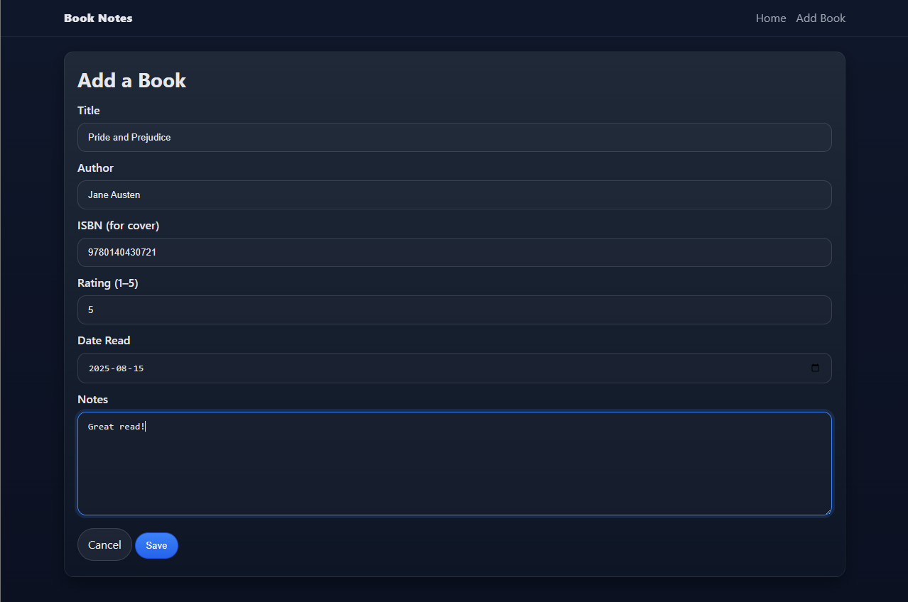
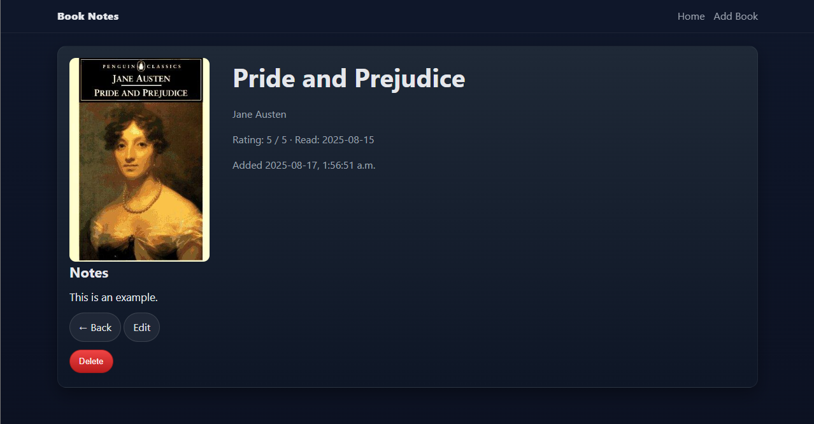

# 📚 Book Notes – Full-Stack CRUD App

**Built with Node.js, Express, EJS, and PostgreSQL**  
**Personal Project** | Aug 2025

---

## 📌 Project Overview

Book Notes is a personal project that lets me track books I’ve read with ratings, dates, and notes. It also pulls book covers from the Open Library Covers API (via ISBN).  
This project focuses on server-side rendering with EJS, integrating a public API, and implementing full CRUD backed by PostgreSQL.

---

## 🚀 Key Features

- ✅ **CRUD functionality** – Create, read, update, and delete book entries  
- ✅ **Sorting** – Sort by **recency**, **rating**, or **title**  
- ✅ **Open Library integration** – Book covers by ISBN (no API key needed)  
- ✅ **Server-side rendering** – Clean EJS views (partials + forms)  
- ✅ **Error handling** – Friendly messages for DB/API errors

---

## 🔧 Tech Stack

- **Backend:** Node.js, Express  
- **Templating:** EJS  
- **Database:** PostgreSQL  
- **HTTP Client:** Axios

---

## ⚙️ Setup Instructions (Local)

1) **Create the database & tables (psql)**  

```sql
-- create an app user (choose your own strong password)
CREATE ROLE booknotes_user WITH LOGIN PASSWORD 'yourpassword';

-- create the database owned by that user
CREATE DATABASE booknotes OWNER booknotes_user;

-- connect to the DB as that user
\c booknotes booknotes_user

-- run the schema
\i 'migrations/001_create_tables.sql'
```

2) **Environment variables**  

```
PGHOST=localhost
PGPORT=5433     
PGDATABASE=booknotes
PGUSER=booknotes_user
PGPASSWORD=yourpassword
PORT=3000
```

3) **Install & run**
```bash
npm install
npm start
# open http://localhost:3000
```

---

## 🧭 App Routes 

| Method | Route               | Description                         |
|-------:|---------------------|-------------------------------------|
| GET    | `/`                 | List all books + sorting control    |
| GET    | `/books/new`        | New book form                       |
| POST   | `/books`            | Create a book                       |
| GET    | `/books/:id`        | View a single book                  |
| GET    | `/books/:id/edit`   | Edit form                           |
| PUT    | `/books/:id`        | Update a book                       |
| DELETE | `/books/:id`        | Delete a book                       |

### API Helpers (Open Library)

| Method | Route                     | Description                                      |
|-------:|---------------------------|--------------------------------------------------|
| GET    | `/api/cover?isbn=...`    | Check if a cover image exists for an ISBN       |
| GET    | `/api/search?title=...`  | Search Open Library by title (returns top 5)    |

---

## 🖥️ App Preview – Book Notes 

### Home Page


### Add a Book Form


### Book Added


### Viewing


### Editing


---

## 💬 Reflection

This project strengthened my understanding of Express routing, EJS templating, and integrating a public API. I designed a simple relational schema in PostgreSQL and implemented full CRUD with clean, server-rendered pages and basic error handling.